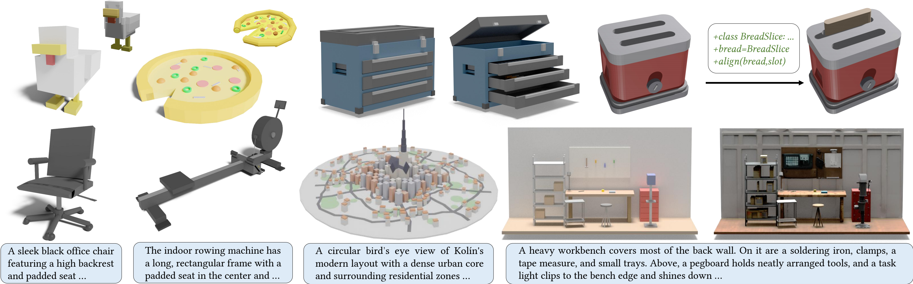

# aDSL: Agentic 3D Creation via Joint Agent-Program Design

[Rui-Huan Wang](https://dylanwrh.github.io/), [Si-Tong Wei](https://wst2001.github.io/), Jia-Qi He,
Heng-Yi Wei, [Baoquan Chen](https://baoquanchen.info/), [Peng-Shuai Wang*](https://wang-ps.github.io/)



## Installation

1. Install [Conda](https://www.anaconda.com/) and create a Python 3.10 environment.
    ```bash
    conda create -n adsl python=3.10
    conda activate adsl
    ```

2. Clone this repository
    ```bash
    git clone https://github.com/DylanWRh/aDSL.git
    cd aDSL
    ```

3. Install the core package with 3D modeling and Blender rendering dependencies
    ```bash
    pip install -e "./adsl-core[mesh,render]" \
      --extra-index-url https://download.blender.org/pypi/
    ```

4. Install the agent workflow dependencies
    ```bash
    pip install -e .
    ```

## LLM Configuration

This repository is built on the [OpenAI Agents SDK](https://openai.github.io/openai-agents-python/) and should support all models officially supported by the SDK.

By default, we use [OpenRouter](https://openrouter.ai/) with *Gemini 3.1 Pro* via an OpenAI-compatible API.

Set your OpenRouter API key with:

```bash
echo -n "YOUR_OPENROUTER_API_KEY" > adsl-agents/configs/keys/openrouter_key.txt
```

The default *Gemini 3.1 Pro* profile is defined in `adsl-agents/configs/llm/openrouter-gemini-3.1-pro.yaml`:

```yaml
provider: openai
api: responses
credential:
  file: ../keys/openrouter_key.txt
params:
  base_url: https://openrouter.ai/api/v1
  model: google/gemini-3.1-pro-preview
  timeout: 300
  max_retries: 0
  max_tokens: 32768
  parallel_tool_calls: false
  include_usage: true
```

## Agentic 3D Generation

The generation process follows an execute–critic–refine loop. By default, the agent runs for up to `2` rounds.

For complex or highly constrained generation tasks, consider increasing the max round to allow additional critic-refinement iterations.

### General Arguments

* `--model-config <path-to-yaml>`: Specify a custom LLM configuration.
* `--max-rounds <N>`: Set the maximum number of execute–critic–refine rounds (default: `2`).

### Text-Conditioned 3D Generation

Generate a 3D asset from a text prompt:

```bash
adsl-run create "A laptop" \
  --output "./outputs/laptop"
```

### Image-Conditioned 3D Generation

Generate a 3D asset from an image:

```bash
adsl-run create "Build the object in this image" \
  --image "./asset/example.png" \
  --output "./outputs/desk-from-image"
```

### Articulated Asset Generation

Use `--articulation` to enable articulated asset generation for either text- or image-conditioned generation.

```bash
adsl-run create "Build the object in this image" \
  --image "./asset/example-arti.png" \
  --output "./outputs/nightstand-arti" \
  --articulation
```
## Chat (Experimental)

> This feature is experimental. CLI behavior, session state, and workspace interfaces may change in future versions.

`adsl-chat` provides a persistent conversational interface for 3D generation. Each turn is routed either to regular chat or to an asset action: `create`, `continue`, `extend`, or `variant`.

Start an interactive chat:

```bash
adsl-chat \
  --workspace outputs/chat
```

The path passed to `--workspace` is the conversation workspace. All assets generated within the session are stored under:

```text
<workspace>/assets/
```

For example, with `--workspace outputs/chat`, generated assets are stored under `outputs/chat/assets/`.

Each asset action uses an independent workspace inside this directory, so the source asset is never overwritten. Conversation state and model-session history are also persisted in the conversation workspace, allowing the same session to be resumed later.

### Interactive Commands

The interactive CLI supports the following slash commands:

* `/help`: Show command help.
* `/paste`: Enter a multiline message, ending with `/end`.
* `/open PATH`: Attach an existing asset workspace.
* `/target PATH`: Reserve a new output path for the next generated or edited asset.
* `/resume PATH`: Load another `chat_state.json` session.
* `/config PATH`: Switch the active model profile.
* `/where`: Show the conversation, active, and pending workspaces.
* `/memories`: List remembered asset workspaces.
* `/exit`: Exit the interactive CLI.

After `/open`, regular chat queries can inspect information from the attached workspace, including the saved request, plan, source, critic results, articulation settings, and run status.

The chat agent can also read a user-specified workspace or its text files when the requested information is not already available in the active conversation context.

### CLI Arguments

```text
adsl-chat --workspace PATH [OPTIONS]
```

| Parameter             | Required | Default                                          | Description                                                                                                             |
| --------------------- | -------- | ------------------------------------------------ | ----------------------------------------------------------------------------------------------------------------------- |
| `--workspace PATH`    | Yes      | —                                                | Conversation workspace. Generated assets are stored under `PATH/assets/`.                                               |
| `--session-file PATH` | No       | `<workspace>/chat_state.json`                    | Load and save chat state using a specific file.                                                                         |
| `--task-id ID`        | No       | Saved task ID or generated UUID                  | Override the task identifier for the session.                                                                           |
| `--model-config PATH` | No       | Saved profile or packaged Gemini 3.1 Pro profile | Select the LLM profile YAML file.                                                                                       |
| `--max-rounds N`      | No       | `2`                                              | Set the maximum number of execute–critic–refine rounds for each asset action initiated from chat. Must be at least `1`. |
| `-h`, `--help`        | No       | —                                                | Show help for the interactive chat CLI.                                                                                 |
